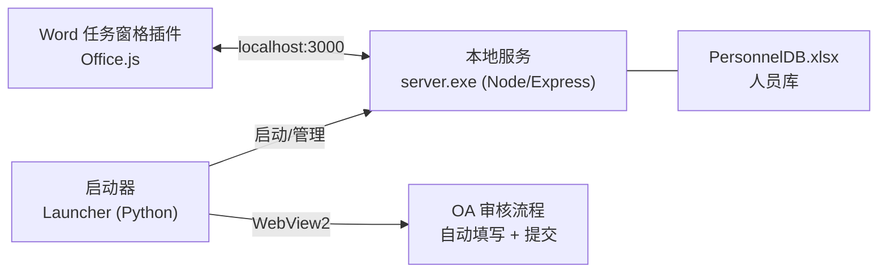
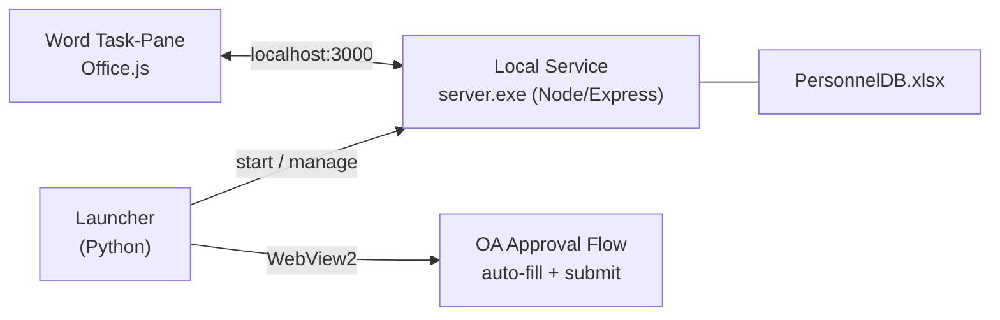

<div align="center">
<a id="top"></a>

# 金元 AI 插件<br/>JINYUAN Research AI Add-in

**一套面向证券研究报告工作流的 Microsoft Word AI 插件：AI 辅助写作 + 一键提交 OA 审核。**

**A Microsoft Word add-in for the securities research workflow: AI-assisted writing + one-click submission to the OA approval system.**

<br/>

[](https://github.com/stevenyang523/jinyuanAI/releases)
[](#)
[](#)

<br/>

### 🌐 语言 / Language

[](#-简体中文)
[](#-english)

<br/>

### ⬇️ 下载 / Download

[](https://github.com/stevenyang523/jinyuanAI/releases/latest)

</div>

---

<a id="-简体中文"></a>

## 🇨🇳 简体中文

> [English version ↓](#-english) ｜ [⬇️ 前往下载页 Releases](https://github.com/stevenyang523/jinyuanAI/releases/latest)

### 简介

**金元 AI 插件** 是一套运行在 Microsoft Word 上的研报工作流工具。分析师在 Word 中撰写研究报告，插件提供 AI 智能辅助、人员/评级配置、相关报告维护，并能**一键把报告自动填写并提交到公司 OA 审核流程**，大幅减少重复的复制粘贴与手工录入。

### ✨ 主要功能

**Word 任务窗格插件**
- **报告模式**：公司首次覆盖/公司点评、行业深度/行业点评，自动匹配对应的评级项与默认报告类型。
- **模型/数据源上传**：支持 `xls / xlsx / xlsm`。
- **分析师与评级配置**：从人员库读取分析师、研究助理名单，配置评级（买入/增持/中性/减持）与评级变化（维持/首次/上调/下调）。
- **相关报告维护**：一键更新相关报告，或仅同步日期、评级及分析师名单。
- **AI 智能助手**：AI 智能纠错、AI 智能问答；AI 接口可配置，支持 **OpenAI 兼容** 与 **Anthropic 兼容** 两种协议。

**一键提交研报到 OA**
- 自动填写 OA "发布研报审核流程"表单：**标题、主要内容、质控审批人员、分析师、报告类型**。
- **自动上传同目录附件**（`xls/xlsx/xlsm/doc/docx/pdf`）。
- OA 环境不可访问时**自动启动 VPN**，连通后**自动打开提交窗口**，无需二次点击。
- 提交窗口**默认最大化**、主程序退出时**自动关闭**、登录页**自动填账号密码**。

**启动器程序（托盘常驻）**
- 本地服务一键启动/停止、首次配置、共享目录配置。
- 报告模板与估值模型快捷入口（A股/港股/美股公司模型、行业模型）。
- 软件更新：检查/下载（可暂停续传）/更新日志，支持 **Beta 测试版通道**。
- 一键检测修复、开机自启、导出日志。

**广泛兼容**
- 从 **Word 2016**到 **Word 2025 / Microsoft 365**一套通用**。

### 🧩 架构



- **Word 插件**：`taskpane.html / taskpane.js`，界面与交互。
- **本地服务**：`server.exe`（前端资源内嵌），桥接插件与系统、托管任务窗格、暂存提交状态、管理人员库。
- **启动器**：`jinyuanai.exe`，服务管理、更新、模板/模型入口、驱动 OA 自动提交窗口。

### 🚀 安装与使用

1. 前往 **[Releases](https://github.com/stevenyang523/jinyuanAI/releases/latest)** 下载最新安装包并安装。
2. 打开**启动器**，等待"首次配置已完成"，确认**本地服务**处于运行中。
3. 打开 **Word**，在功能区打开插件任务窗格。
4. 在 **AI API 配置** 中填写并保存接口信息（OpenAI 兼容 / Anthropic 兼容）。
5. 撰写报告 → 配置分析师/评级 → 一键提交到 OA。

> 详细的初次使用、日常使用与常见问题，请参见随包附带的《使用帮助》。

### 🛠️ 从源码构建（开发者）

- **启动器（Python）** → 用 PyInstaller 打包为 `.exe`。
- **本地服务（Node）** → 用 [`@yao-pkg/pkg`](https://github.com/yao-pkg/pkg) 将 `server.js` 与前端资源打包为自包含的 `server.exe`：
  ```bash
  npm install
  npm install -D @yao-pkg/pkg
  npx pkg . --targets node22-win-x64 --output dist/server.exe
  ```

### 📌 说明

- 本项目仅供证券公司内部投研工作使用。

<div align="right"><a href="#top">⬆️ 回到顶部 / Back to top</a></div>

---

<a id="-english"></a>

## 🇬🇧 English

> [中文版 ↑](#-简体中文) ｜ [⬇️ Go to Releases](https://github.com/stevenyang523/jinyuanAI/releases/latest)

### Overview

**Jinyuan AI Plugin** is a workflow tool for research report production that operates within Microsoft Word. Designed to assist analysts while they draft reports, the plugin offers AI-powered support, manages personnel and rating configurations, and handles related report data. It also enables users to **automatically populate and submit reports to the company’s OA approval workflow with a single click**, significantly reducing repetitive copy-pasting and manual data entry.

### ✨ Features

**Word Task-Pane Add-in**
- **Report modes**: company initiation / company note, industry deep-dive / industry note — each auto-mapping the right rating options and default report category.
- **Model / data-source upload**: `xls / xlsx / xlsm`.
- **Analyst & rating setup**: reads analyst and assistant lists from the personnel database; configure rating (Buy / Overweight / Neutral / Underweight) and rating change (Maintain / Initiate / Upgrade / Downgrade).
- **Related-report maintenance**: one-click update, or sync date, rating and analyst list only.
- **AI assistant**: AI proofreading and AI Q&A; configurable AI endpoint supporting **OpenAI-compatible** and **Anthropic-compatible** protocols.

**One-Click Submission to OA**
- Auto-fills the OA "research-report publishing approval" form: **title, main body, QC approver, analyst, report category**.
- **Auto-uploads attachments** from the report's folder (`xls/xlsx/xlsm/doc/docx/pdf`).
- If the OA environment is unreachable, **starts the VPN automatically** and **opens the submission window once connected** — no second click needed.
- The submission window **opens maximized**, **closes automatically** when the launcher exits, and the **login page is auto-filled**.

**Launcher (system-tray resident)**
- Start/stop the local service, first-time setup, shared-folder configuration.
- Quick access to report templates and valuation models (A-share / HK / US company models, industry model).
- Software updates: check / download (pause & resume) / release notes, with a **Beta channel**.
- One-click diagnose & repair, run-at-startup, export logs.

**Broad Compatibility**
- One build works from **Word 2016**  to **Word 2021 / Microsoft 365** .

### 🧩 Architecture



- **Word add-in**: `taskpane.html / taskpane.js` — UI and interaction.
- **Local service**: `server.exe` (front-end assets embedded) — bridges the add-in and the system, serves the task pane, stores submission state, manages the personnel DB.
- **Launcher**: `jinyuanai.exe` — service management, updates, template/model entries, and drives the OA auto-submission window.

### 🚀 Install & Use

1. Download the latest installer from **[Releases](https://github.com/stevenyang523/jinyuanAI/releases/latest)** and install it.
2. Open the **Launcher**, wait for "first-time setup complete", and confirm the **local service** is running.
3. Open **Word** and launch the add-in task pane from the ribbon.
4. In **AI API Settings**, enter and save your endpoint (OpenAI-compatible / Anthropic-compatible).
5. Write a report → configure analyst/rating → submit to OA in one click.

> For detailed first-time / daily usage and troubleshooting, see the bundled **User Guide**.

### 🛠️ Build from Source (developers)

- **Launcher (Python)** → packaged into an `.exe` with PyInstaller.
- **Local service (Node)** → packaged with [`@yao-pkg/pkg`](https://github.com/yao-pkg/pkg) into a self-contained `server.exe` (front-end assets embedded):
  ```bash
  npm install
  npm install -D @yao-pkg/pkg
  npx pkg . --targets node22-win-x64 --output dist/server.exe
  ```

### 📌 Notes

- This project is intended solely for the internal investment research activities of securities firms.


<div align="right"><a href="#top">⬆️ Back to top</a></div>
